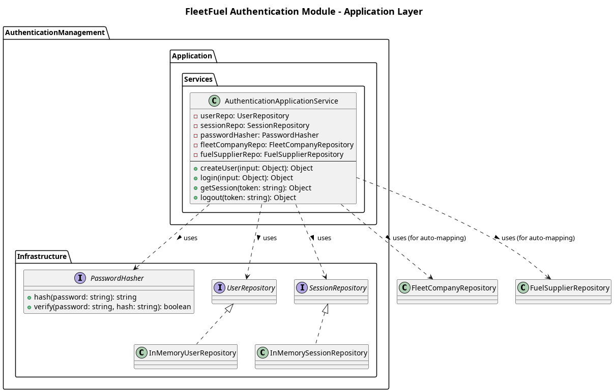

## The Application Layer

The **Application layer** for the Authentication module orchestrates the identity workflows. It bridges the REST endpoints from the Presentation layer to the core entities in the Domain layer.

**Services**
1. `AuthenticationApplicationService`
    - Manages `createUser(input)`, `login(input)`, `verifySession(sessionId)`, and `logout(sessionId)`.
    - Handles automatic routing and mapping of external module entities (e.g. creating a `FleetCompany` profile if the newly registered user has the `FLEET_COMPANY` role).

