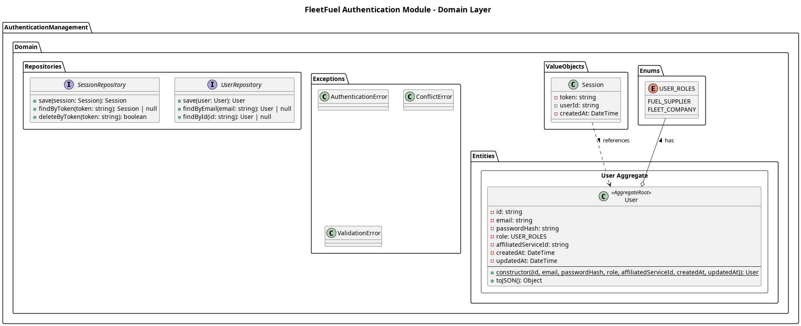

## The Domain Layer

The **Authentication Module** domain layer houses the core business entities regarding identity. It is completely isolated from infrastructure specific implementation such as the persistence mechanism.

This layer is comprised of:
- Entities
- Value Objects and Enums
- Repositories

**Entities**
1. User
    - The core aggregate root representing an authenticated individual in the system.

**Value Objects & Enums**
1. Role
    - Defines the specific system privileges the `User` is entitled to (e.g., FLEET_COMPANY, FUEL_SUPPLIER, FLEET_MANAGER).
2. Email
    - Validates and stores the user's email address.
3. Password
    - A secure container for a hashed password string.

**Repositories**
1. UserRepository
    - An interface dictating how `User` aggregates are saved and retrieved (e.g., `findByEmail`, `findById`, `save`).

