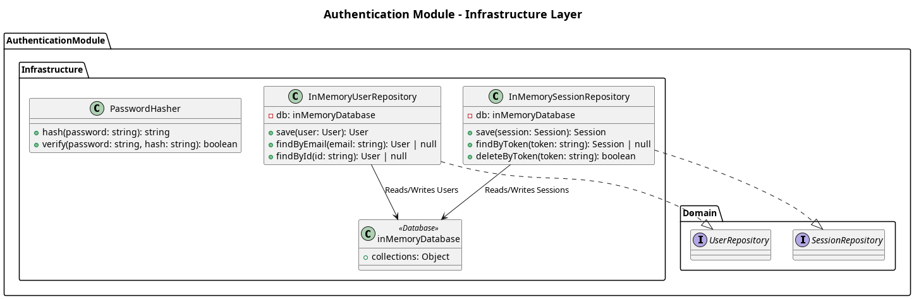

## The Infrastructure Layer

The **Infrastructure layer** handles the low-level details of data persistence and external integrations for the Authentication module.

**Data Storage**
- `inMemoryDatabase.mjs`: Currently utilizes an in-memory data store structure to simulate database behavior, providing rapid prototyping and development without the overhead of spinning up a full database server.

**Repositories Implementations**
- Implements the `UserRepository` interface defined in the domain layer to write, update, and retrieve `User` objects from memory.

