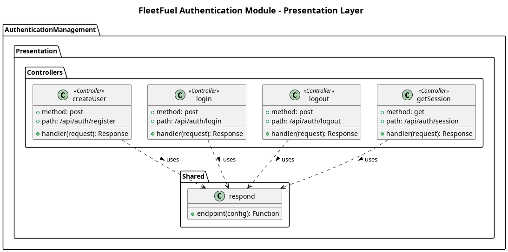

## The Presentation Layer

The **Presentation layer** exposes the functionalities of the Authentication module to external clients (e.g., frontend applications) over HTTP/REST.

**Controllers**
1. `AuthenticationController`
    - Handles incoming HTTP requests for `POST /api/auth/register`, `POST /api/auth/login`, `GET /api/auth/session`, and `POST /api/auth/logout`.
    - Responsible for validating request bodies, mapping them to inputs, and returning standardized HTTP responses.

