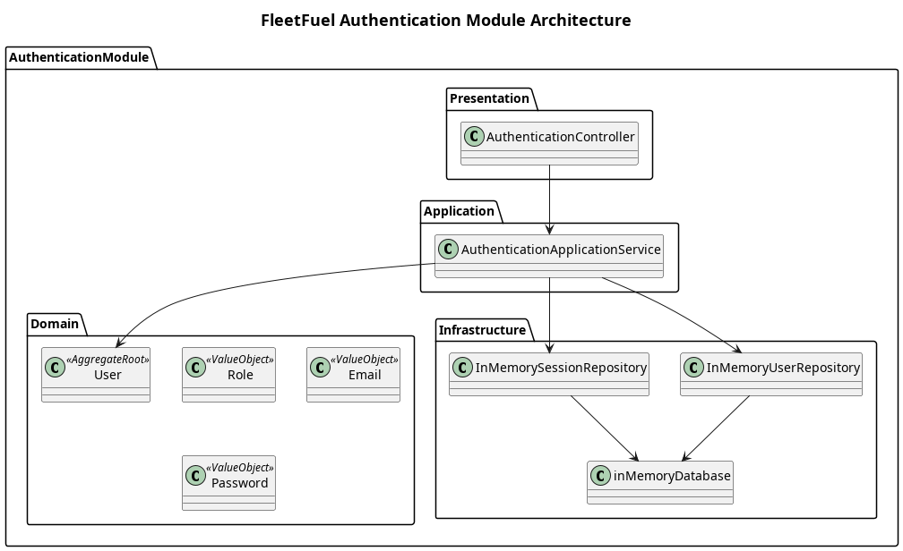

# Authentication Module

This module manages user authentication and authorization within the FleetFuel platform. It ensures secure access to system resources by providing a central mechanism for users (Fleet Managers, Fuel Suppliers, etc.) to register, log in, and manage their sessions securely.

## System Overview

The **Authentication Module** is responsible for establishing a user's identity and their associated role. It abstracts away the complexity of user management from other modules.

Following the project's **layered architecture**, the module is structured into:
1. **[Domain layer](Domain/README.md)**: Defines the core `User` and `Role` entities.
2. **[Application layer](Application/README.md)**: Manages authentication workflows, password hashing, and token generation.
3. **[Infrastructure layer](Infrastructure/README.md)**: Connects to the database to persist user data.
4. **[Presentation layer](Presentation/README.md)**: Exposes RESTful endpoints for login and registration.

This ensures the authentication logic is decoupled and reusable across the entire platform.

The module supports:
- User registration (automatically mapping users to their respective companies/suppliers based on roles).
- User login and session creation.
- Session verification and role retrieval.
- User logout.

## Architecture

## Scope

| In Scope | Out of Scope |
| --- | --- |
| User registration and secure password storage | Advanced OAuth2/Social Login |
| Login/Logout and session creation | Multi-Factor Authentication (MFA) |
| Role-based access mapping | Complex permissions matrix within a single role |

## Design Principles

1. **Simplicity First**: Simple session management and basic role mapping to meet current project timelines without overengineering an identity provider.
2. **Single-Tenant Mapping**: The system enforces that a newly registered user for a specific role (like a fleet company) is strictly mapped to that company context.
