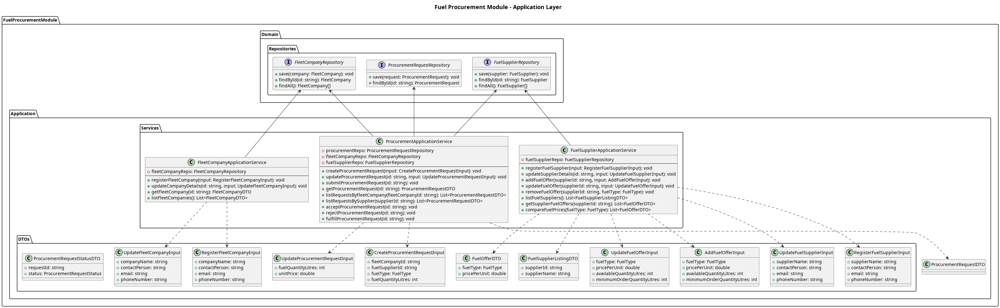

## The Application Layer

The **Application layer** coordinates the workflow between `FleetCompany`, `FuelSupplier`, and `ProcurementRequest` entities.

**Services**
1. `FleetCompanyApplicationService`
    - Manages the registration and updates of fleet company profiles.
2. `FuelSupplierApplicationService`
    - Manages the registration of fuel suppliers, and allows them to update their fuel offers.
    - Provides read methods for fleet companies to view and compare fuel prices across suppliers.
3. `ProcurementApplicationService`
    - Orchestrates the actual transactional workflow: submitting a new request, approving a request, rejecting a request, or fulfilling it.

