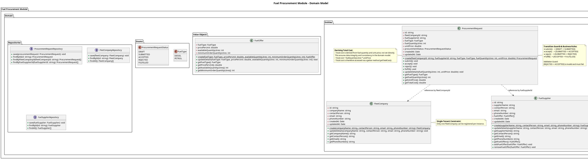

## The Domain Layer

The **Fuel Procurement Module** domain layer houses the core business entities for the procurement process. It is completely isolated from infrastructure-specific implementation details.

This layer is comprised of:
- Entities
- Value Objects and Enums
- Repositories

**Entities**
1. FleetCompany
    - The buyer entity that submits procurement requests.
2. FuelSupplier
    - The seller entity that manages fuel offers.
3. ProcurementRequest
    - The core transactional entity that represents a request for fuel, moving through various states (e.g., PENDING, APPROVED).

**Value Objects & Enums**
1. FuelOffer
    - A value object representing a fuel type, quantity available, and price per liter offered by a `FuelSupplier`.
2. Name & Address
    - Basic value objects holding string attributes for names and physical locations.
3. ProcurementStatus
    - An enum tracking the state of a `ProcurementRequest` (e.g., `PENDING`, `APPROVED`, `REJECTED`, `FULFILLED`).
4. FuelType
    - Defines the specific fuel requested (e.g., `DIESEL`, `UNLEADED`).

**Repositories**
1. FleetCompanyRepository
2. FuelSupplierRepository
3. ProcurementRequestRepository

These repositories define the standard CRUD interfaces to manage the lifecycle of the domain entities.

