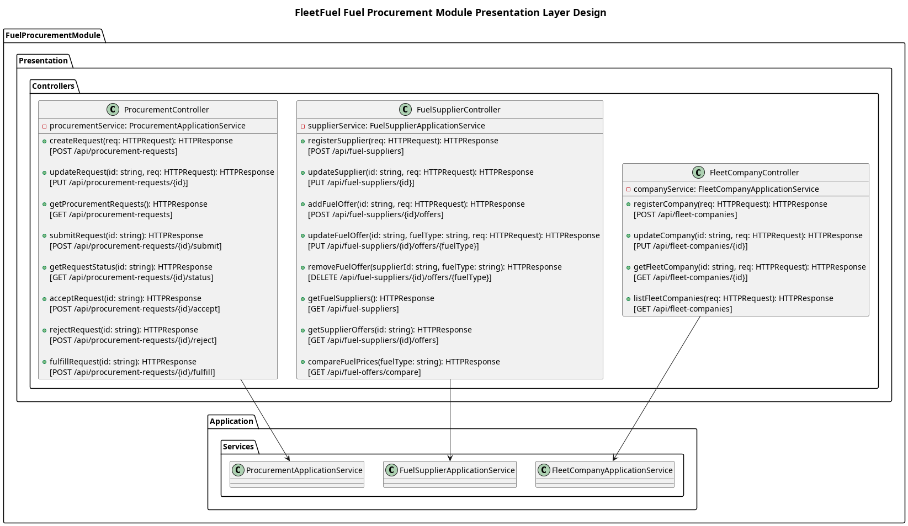

## The Presentation Layer

The **Presentation layer** provides the REST API endpoints to manage procurement workflows.

**Controllers**
1. `FleetCompanyController`
    - Handles requests for `POST /api/fleet-companies` (register) and `PUT /api/fleet-companies/{id}` (update).
2. `FuelSupplierController`
    - Handles endpoints related to suppliers: registration, viewing offers, and comparing prices across the supplier marketplace (`GET /api/fuel-suppliers`, `GET /api/fuel-suppliers/offers`).
3. `ProcurementController`
    - Handles the core business workflows: submitting requests (`POST /api/procurement/requests`), listing them, and advancing their states (`PUT /api/procurement/requests/{id}/approve`).

