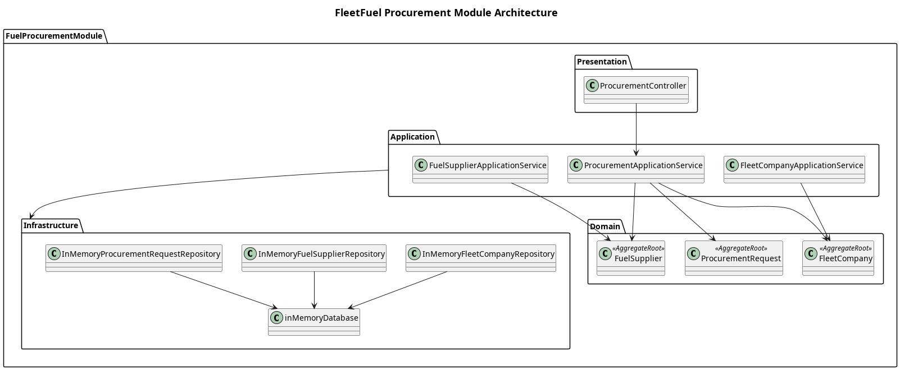

# Fuel Procurement Module

This architecture addresses the process of how fleet companies procure fuel from various fuel suppliers. It defines the core interaction between buyers (Fleet Companies) and sellers (Fuel Suppliers).

## System Overview

The **Fuel Procurement Module** handles the marketplace aspect of FleetFuel. Fleet companies can view available fuel suppliers, compare their fuel offers, and submit procurement requests to fulfill their fleet's needs.

The module follows a **layered architecture** consisting of:
1. **[Domain layer](Domain/README.md)**: Core entities like `FleetCompany`, `FuelSupplier`, `FuelOffer`, and `ProcurementRequest`.
2. **[Application layer](Application/README.md)**: Services to coordinate the procurement workflow between buyers and sellers.
3. **[Infrastructure layer](Infrastructure/README.md)**: Data persistence mechanics.
4. **[Presentation layer](Presentation/README.md)**: REST APIs exposing supplier data and procurement request workflows.

The module currently supports:
- Fuel Supplier registration and fuel offer management.
- Fleet Company profiling.
- Viewing and comparing fuel offers.
- Submitting and approving/rejecting fuel procurement requests.

## Architecture

## Scope

| In Scope | Out of Scope |
| --- | --- |
| Managing fuel suppliers and their fuel offers | Real-time negotiation or bidding platforms |
| Managing fleet company profiles | External accounting software integrations |
| Creating, reviewing, and fulfilling procurement requests | Complex supply chain logistics and delivery tracking |

## Design Principles

1. **Single-Tenant Mapping**: Ensures that once a user is authenticated, their interactions are strictly scoped to their respective `FleetCompany` or `FuelSupplier` instance.
2. **Separation of Concerns**: Procurement logic is neatly separated between buyer management, seller management, and the overarching transaction workflow.
