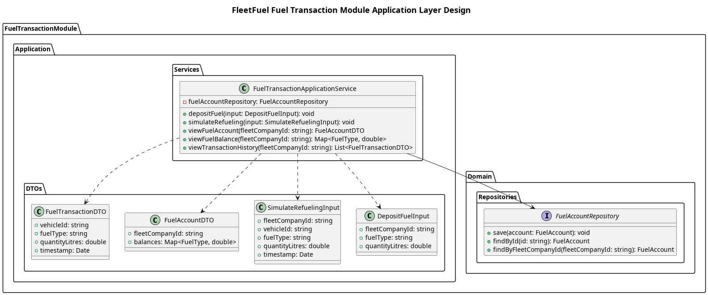

## The Application Layer

The **Application layer** coordinates the ledger workflows and exposes the core use cases of the module.

**Services**
1. `FuelTransactionApplicationService`
    - Handles deposits (e.g., when a fuel procurement request is successfully fulfilled).
    - Handles refueling simulations (withdrawing fuel from the fleet's logical account to a specific vehicle).
    - Retrieves the current account balance and transaction history.

