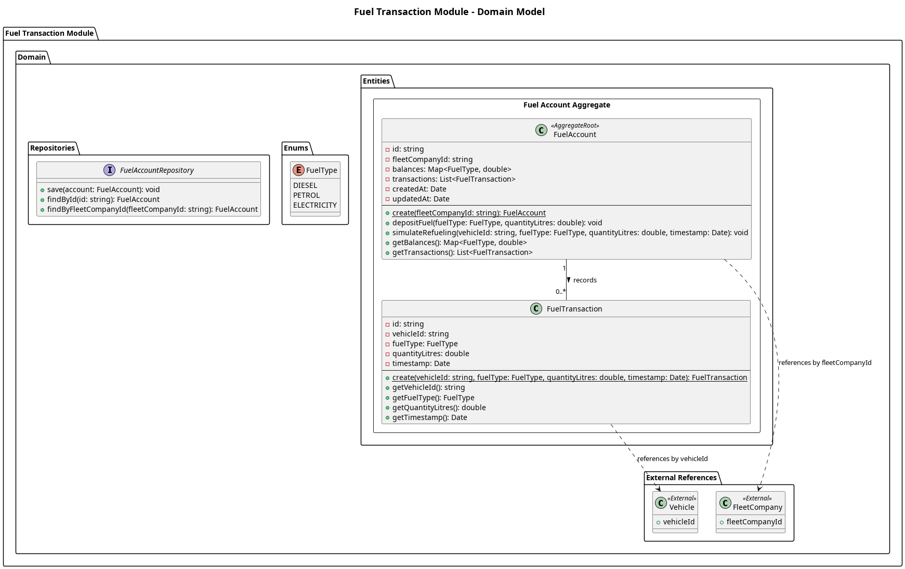

## The Domain Layer

The **Fuel Transaction Module** domain layer houses the core business entities for the ledger system.

This layer is comprised of:
- Entities
- Value Objects and Enums
- Repositories

**Entities**
1. FuelAccount
    - The core aggregate root representing a ledger account for a specific `FleetCompany`.
    - It tracks the current `fuelBalance` (in liters) and maintains a history of transactions.

**Value Objects & Enums**
1. FuelTransaction
    - An immutable value object representing a single ledger entry (a deposit or a withdrawal).
    - It records the `type` of transaction, the `quantity`, and a `timestamp`.
2. TransactionType
    - An enum representing the flow of fuel (`DEPOSIT` or `WITHDRAWAL`).

**Repositories**
1. FuelAccountRepository
    - Dictates the contract for saving and retrieving `FuelAccount` aggregates from storage.

