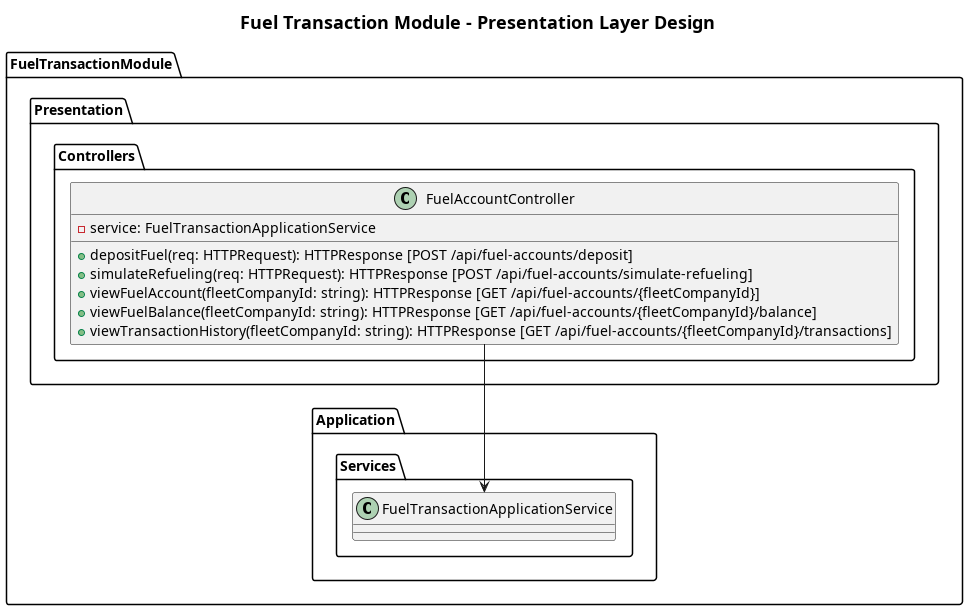

## The Presentation Layer

The **Presentation layer** provides the REST API endpoints to manage fuel deposits and withdrawals.

**Controllers**
1. `FuelAccountController`
    - Handles requests for `POST /api/transactions/deposit`, `POST /api/transactions/simulate-refueling`, and `GET /api/transactions/account/{fleetCompanyId}`.

