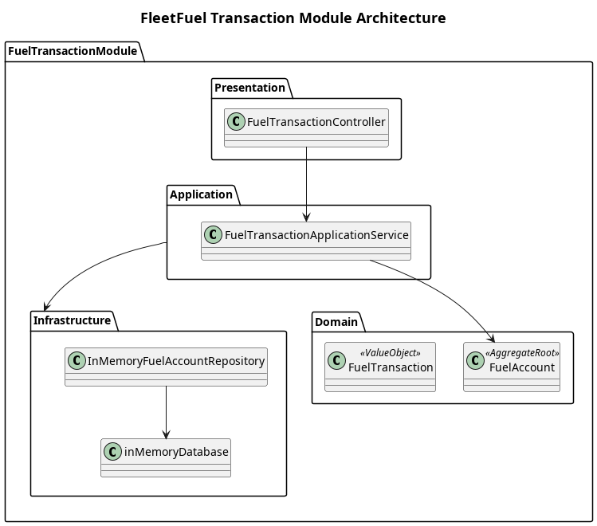

# Fuel Transaction Module

This module is responsible for the financial accounting and transaction histories of fuel consumption. It serves as the ledger recording all fuel deposits and refueling operations.

## System Overview

The **Fuel Transaction Module** acts as the financial backend for the FleetFuel platform. It handles the logical accounts where fuel is "deposited" (purchased via the Procurement Module) and "withdrawn" (consumed by vehicles during simulated refueling).

The module follows a **layered architecture** consisting of:
1. **[Domain layer](Domain/README.md)**: Contains the core logic for the `FuelAccount` and `FuelTransaction` ledger.
2. **[Application layer](Application/README.md)**: Coordinates deposits and withdrawals on the fuel accounts.
3. **[Infrastructure layer](Infrastructure/README.md)**: Houses the persistence layer for account and transaction history.
4. **[Presentation layer](Presentation/README.md)**: Exposes endpoints to trigger deposits and view fuel account balances.

The module supports:
- Creating and managing fuel accounts linked to specific fleet companies.
- Depositing fuel (increasing balance) upon successful procurement.
- Simulating refueling (decreasing balance and recording a transaction).
- Viewing transaction history and current fuel balance.

## Architecture

## Scope

| In Scope | Out of Scope |
| --- | --- |
| Tracking logical fuel balances (liters) for a company | Handling actual fiat currency transactions |
| Recording fuel deposit and withdrawal events | Invoicing or billing logic |
| Ensuring fuel account bounds (no negative fuel balances) | Integrating with actual gas station payment gateways |

## Design Principles

1. **Immutability of Transactions**: Once a `FuelTransaction` is recorded, it acts as an immutable ledger entry.
2. **High Cohesion**: The module exclusively deals with liters of fuel as an abstract currency, staying decoupled from procurement costs and vehicle telemetry constraints.
