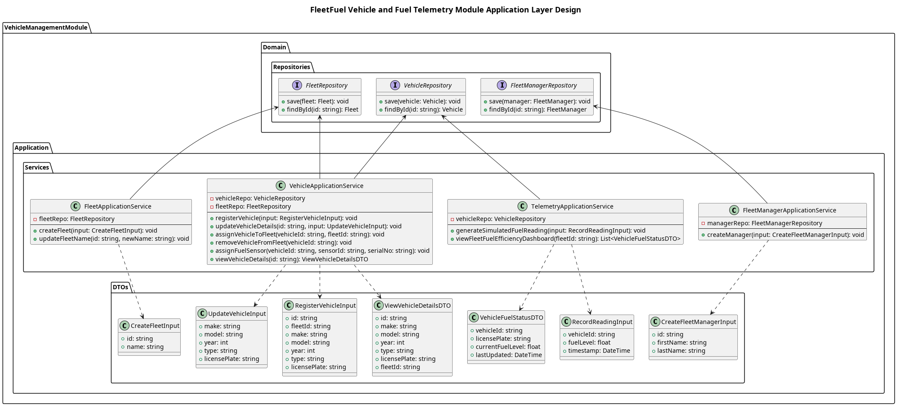

## The Application Layer
The domain layer, as discussed above, holds the model for business logic and rules and must remain uncontaminated by infrastructure specific implementations of that logic. This is achieved by placing a layer that will orchestrate defined workflows as "doors" for other components to access the domain model. This layer is the **application layer.**

The application layer, through the repositories exposed by the domain layer, coordinates use cases as workflows employing the domain layer. This ensures that an external component accesses the domain layer through a specific use case.

The use cases orchestrated in this module are the features exposed to the user, and they are managed in the **application services**:
**1. Fleet application service**
- Implements the following use cases:
	1. Create fleet
	2. Update fleet name

**2. Fleet manager application service**
- Implements the following use case:
	1. Create fleet manager

**3. Vehicle application service**
- Implements the following use cases:
	1. Register vehicle
	2. Update vehicle details
	3. View vehicle details
	4. Assign vehicle to fleet
	5. Remove vehicle from fleet
	6. Assign fuel sensor

**4. Telemetry application service**
- Implements the following use cases:
	1. Generate simulated fuel reading
	2. Trigger fuel theft alert (as an extension of **generate simulated fuel reading** use case)
	3. View fuel efficiency dashboard

The use case implementations in the application layer are conceptual ie. no actual specific technologies are included. It knows that to "create fleet" it must save it through the **save()** method in the **fleet repository** but it doesn't how exactly or where that data is being saved. That is done by the **infrastructure layer**.