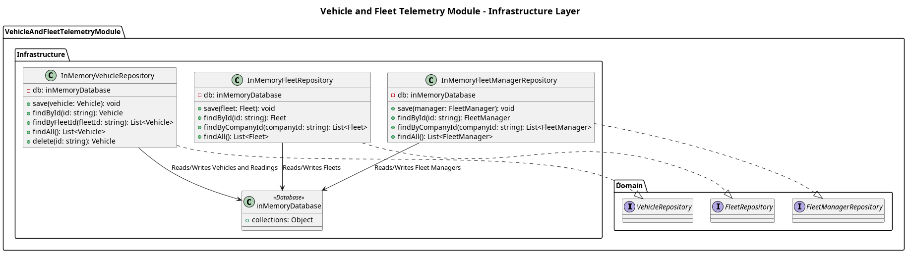

## The Infrastructure Layer

The **Infrastructure layer** manages data persistence for the Vehicle and Fleet Telemetry module. It isolates the domain and application layers from the low-level database operations.

### Data Storage
- `inMemoryDatabase.mjs`: Currently acts as an in-memory data store to simulate a database environment, ensuring rapid prototyping and zero-configuration development.

### Repository Implementations
This layer implements the abstract interfaces defined in the Domain layer to interact with the database simulation:
- **`InMemoryVehicleRepository`**: Manages the persistence, updating, and retrieval of `Vehicle` entities and their simulated telemetry readings.
- **`InMemoryFleetRepository`**: Handles storing and fetching `Fleet` entities.
- **`InMemoryFleetManagerRepository`**: Manages `FleetManager` records.

### Architecture

