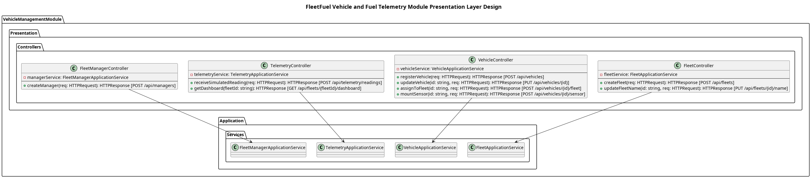

## The Presentation Layer
Similar to the application layer, the presentation layer acts as a **gateway to the external world**. But in contrast, it rests between the environment outside the module and the application layer and not the domain layer. Furthermore, the presentation layer includes infrastructure specific technologies to accomplish its function. Such technologies, and one that we use in our design, include **HTTP REST APIs**. The layer will host the api definitions as contracts for how data is catered to the outside world and what is required from outside to receive "service" from the module.

These contracts are defined in the **controllers** within the layer. Each HTTP endpoint is implemented in its own module file. BFast discovers those endpoint descriptors recursively from the configured Presentation functions folder.

Our controllers are:

**1. Fleet controller**
- Exposes API endpoints according to the fleet use cases defined in the application layer:
	1. Create fleet -  *[POST /api/fleets]*
	2. Update fleet name - *[PUT /api/fleets/:id/name]*

**2. Fleet manager controller**
- Exposes API endpoints according to the fleet manager use cases defined in the application layer:
	1. Create manager - *[POST /api/managers]*

**3. Vehicle controller**
- Exposes API endpoints according to the vehicle use cases defined in the application layer:
	1. Register vehicle - *[POST /api/vehicles]*
	2. Update vehicle details - *[PUT /api/vehicles/:id]*
	3. Assign vehicle to fleet - *[POST /api/vehicles/:id/fleet]*
	4. Remove vehicle from fleet - *[Delete /api/vehicles/:id]*
	5. Assign fuel sensor - *[POST /api/vehicles/:id/fuel-sensor]*

**4. Telemetry controller**
- Exposes API endpoints according to the telemetry use cases defined in the application layer:
	1. Receive simulated fuel reading - *[POST /api/telemetry/readings]*
	2. View fuel efficiency dashboard - *[GET /api/fleets/:fleetId/dashboard]*
