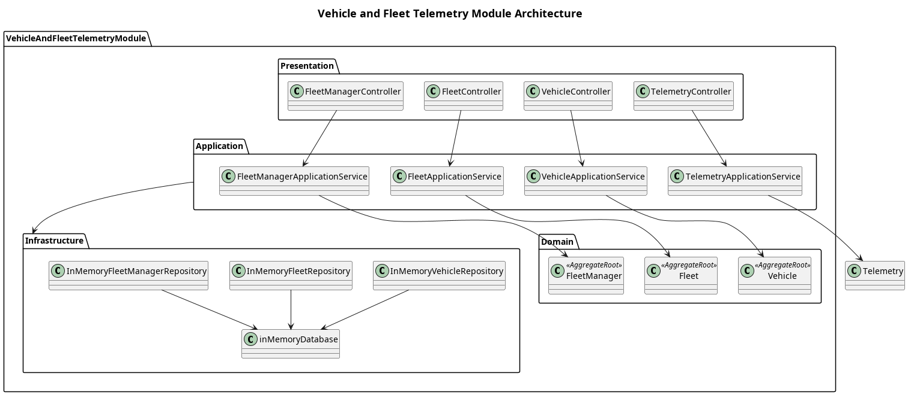

# Vehicle and Fuel Telemetry Module - Sprint 1
This architecture addresses the difficulty logistics companies face in **monitoring their vehicles' fuel consumption** in real time as part of their whole fleet. It is the core model of the solution that attaches fuel sensors to all vehicles in available fleets to simulate monitoring fuel consumption in real-time.

## System Overview
The **vehicle and fuel telemetry module** is responsible for managing fleet vehicles and monitor their fuel consumption as part of the FleetFuel whole system.

It addresses the lack of real-time visibility of fuel consumption in fleet vehicles. It achieves this by generating simulated fuel sensor readings from the fuel sensor through the "simulation engine", process and log it, allowing for viewing later by the fleet manager.

The module follows a **layered architecture** consisting of the following layers:
1. **[Domain layer](Domain/README.md)**, where all core business logic lives with its entities isolated from infrastructure specific implementation.
2. **[Application layer](Application/README.md)** which orchestrates module use cases, coordinating them to their designated business logic in the domain layer.
3. **[Infrastructure layer](Infrastructure/README.md)**, where actual infrastructure specific technologies are implemented to realize the business logic.
4. **[Presentation layer](Presentation/README.md)** which presents an interface for entities outside the module to communicate with it, implementing technologies such as REST APIs.

This architecture realizes the modularity design principle due to how each layer it encapsulates its own data and behavior while exposing clear interfaces for other layer to communicate with it - consequently promoting low coupling.

Fleet managers interact with the system through REST API endpoints exposed in the presentation layer. Each endpoint will be connected to its specific use case in the application layer to access the required business functionality, to which explicit infrastructure implementation will be done in the infrastructure layer.

The module currently supports:
1. Fleet creation and management
2. Vehicle registration and assignment
3. Fuel sensor assignment to vehicles
4. Fuel sensor reading simulation through the simulation engine
5. Dashboard viewing of live fuel sensor readings for fleet vehicles
6. Simple fuel theft alerts through simulated fuel sensor readings

## Architecture

## Scope  
The scope of this module is limited to the solving the core problem: **difficulty tracking real-time fuel consumption in a company's fleet**

| In Scope                                                           | Out of Scope                                                    |
| ------------------------------------------------------------------ | --------------------------------------------------------------- |
| Fuel sensor simulation with dummy generated fuel readings          | Actual sensor implementation with real-time telemetry ingestion |
| Basic vehicle management crud logic                                | Complex vehicle management workflows including searching        |
| Simple crud fleet management including assigning vehicles to fleet | Complex workflows including searching                           |
| Fleet manager registration and other simple crud                   | No major auth or person management features                     |
 
## Design Principles  
This module is deliberately design with the following principles in mind:

**1. Simplicity**
- The design will adheres to the KISS principle as a default to **ensure less complexity**. The variables in consideration are: the team's current **technological competence** and the **tight timeline** imposed by the project.
- This principle is highlighted in decision such as **simulating fuel sensor ingestion** instead of implementing actual fuel sensor ingestion with real-time telemetry ingestion.
- Furthermore, the decision to introduce controlled coupling between the vehicle and the fuel sensor with its fuel sensor reading is another instance enforcing this principle since complex ingestion logic is avoided - this saves us the trouble of introducing a separate module for a simple component not yet in need for isolation.

**2. Focus on solving core problem**
- The design focuses on addressing the core pain point first, everything else is put on hold. This enforces the **You Aren't Going to Need It (YAGNI)** principle, allowing us to streamline our solution to only the required functionalities
- The absence of authentication, analytics, and other "cool" features is evidence of this principle since those do not immediately address the core problem.

**3. Modularity and Encapsulation**
- The design heavily enforces modular components by encapsulating business domain, isolating it from direct access. This is done through the employment of **layered architecture**, to which the domain is accessed through clear interfaces and orchestration of the application layer.
- This method allows for a single code base but with less coupling - a modular monolith. Perfect for the small team we have, keeping things separate with overloading the team.
