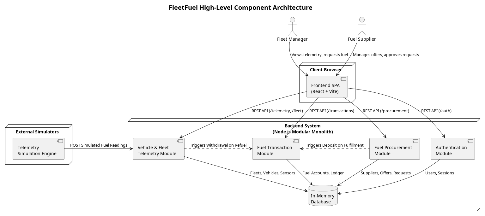

# FleetFuel

FleetFuel is a comprehensive logistics and supply chain solution designed to address the difficulties logistics companies face in monitoring their vehicles' fuel consumption in real time and procuring fuel efficiently.

By simulating live fuel sensor telemetry and offering a dedicated marketplace for fuel procurement, FleetFuel bridges the gap between fleet management, real-time vehicle monitoring, and fuel supply chains.

## Project Structure

This repository is split into two primary components:

### 1. Backend (`/Backend`)
The backend is a Node.js-based modular monolith following Domain-Driven Design (DDD) principles. It is broken down into specific business domains, each with its own isolated bounded context:
- **AuthenticationModule**: User identity and role mapping.
- **FuelProcurementModule**: The marketplace connecting Fleet Companies to Fuel Suppliers.
- **FuelTransactionModule**: The financial ledger tracking abstract fuel balances.
- **VehicleAndFleetTelemetryModule**: Real-time vehicle monitoring and fleet organization.

For detailed backend setup instructions, architecture documentation, and how to run tests, see the [Backend README](./Backend/README.md).

### 2. Frontend (`/Frontend`)
The frontend is a web application built to consume the backend APIs and present dedicated user interfaces based on the logged-in user's role (e.g., a dashboard for Fleet Companies to monitor vehicles and procure fuel, and a dashboard for Fuel Suppliers to manage their offers).

## Getting Started

To run the full stack locally:

1. **Start the Backend:**
   Navigate to the `Backend` directory, install dependencies, and run the server.
   ```bash
   cd Backend
   npm install
   npm run start
   ```

2. **Start the Frontend:**
   Navigate to the `Frontend` directory, install dependencies, and start the development server. (Please consult the frontend-specific documentation for detailed commands).

## Core Features

- **Single-Tenant Architecture**: Users (whether a fleet company or fuel supplier) operate strictly within their own contextual sandbox.
- **Simulated Real-Time Telemetry**: Connects "dummy" fuel sensors to vehicles and streams telemetry to monitor fuel levels in real time.
- **Automated Fuel Marketplace**: Fleet companies can view available suppliers, compare fuel prices, and submit procurement requests.
- **Immutable Transaction Ledger**: Every drop of fuel deposited (procured) or withdrawn (consumed) is tracked immutably in the transaction ledger.

## Architecture

The system utilizes a modular monolith approach on the backend. This choice was made to ensure low coupling (via strict layer isolation: Domain, Application, Infrastructure, Presentation) while maintaining the simplicity of a single deployment unit. 

